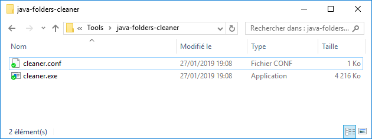

# java-folders-cleaner

`java-folders-cleaner` is a standalone program allowing to easily and automatically remove useless files from :

- eclipse workspaces
- eclipse projects
- eclipse installations

Files to remove are customizables.

Benefits are for example :

- remove OSGI temporary files in order to have an eclipse installation faster to start
- remove useless files in order to retrieve some disk space usage

Program is written in `golang` and is working fine under Windows or Linux.

## Easy launch 

Just put the .exe and its associated configuration file `launcher.conf` in your workspace folder and execute it (through double-click, or from a `cmd.exe` command line execution).

## Advanced launch

Launch manually the tool with (`.bat` or from `cmd.exe`) with :

```
java-folders-cleaner --folders <folder1>,<folder2>,...
```

## Configuration

Configuration file has just to be located in the same folder than the executable, with the same name ending by `.conf`.



Example of java configuration :

```
**/*.tmp

[projects]
**/bin
**/build
**/classes
**/web/WEB-INF/classes
**/dist
**/target
**/*.class
**/*.log
# **/.cache
# **/work

[workspaces]
**/.metadata/.plugins/org.eclipse.core.resources/.history
**/.metadata/.plugins/org.eclipse.jdt.core/*

[eclipse]
**/*.log
**/configuration/org.eclipse.osgi/*
```

Possible sections are :

- `projects` : folder containing an eclipse project, that means containing a `.project` or `.classpath` file
- `workspaces` : folder containing an eclipse workspace, that means containing a `.metadata` sub-folder
- `eclipse` : folder containing an eclipse installation, that means containing an `eclipse.exe` file

First lines (the ones without sections) are applyed everywhere (whatever the kind of detected folder, and in addition to patterns declared in a section).

Comments are possible through lines starting with `#`.

## Usage

```bash
cleaner

Usage:
  cleaner [flags]
  cleaner [command]

Available Commands:
  help        Help about any command
  version     Prints the version of the chainer command.

Flags:
      --debug             Is debug activated (false by default)
      --folders string    Folders to clean, separated by commas. Current folder will be used as a default, if --folders is not defined.
  -h, --help              help for cleaner
      --patterns string   Override default patterns (only used if no configuration file found). Separate values with commas.

Use "cleaner [command] --help" for more information about a command.

```

## Log output

Example :

```
$ ../saig/trunk/cleaner.exe
Loading configuration from [C:\Users\sersimon\workspaces\projects-psa\saig\trunk\cleaner.conf]
Now cleaning java useless items from [.] with patterns [.cache, bin, build, classes, dist, target, work, *.class]
- [DELETE] path [trunk\pmm-archetype-occurrences\bin] (matching pattern is [bin])
- [DELETE] path [trunk\pmm-core\bin] (matching pattern is [bin])
- [DELETE] path [trunk\pmm-core\work] (matching pattern is [work])
- [DELETE] path [trunk\pmm-logplayer\bin] (matching pattern is [bin])
- [DELETE] path [trunk\pmm-site\bin] (matching pattern is [bin])
- [DELETE] path [trunk\pmm-war-backoffice\bin] (matching pattern is [bin])
- [DELETE] path [trunk\pmm-war-webapp\bin] (matching pattern is [bin])
- [DELETE] path [trunk\pmm-web-services-forcagescheminement\WebContent\WEB-INF\classes] (matching pattern is [classes])
- [DELETE] path [trunk\pmm-webapp\web\WEB-INF\classes] (matching pattern is [classes])
- [DELETE] path [trunk\pyr01\bin] (matching pattern is [bin])
- [DELETE] path [trunk\pyr02\bin] (matching pattern is [bin])
- [DELETE] path [trunk\pyr03\bin] (matching pattern is [bin])
- [DELETE] path [trunk\pyr04\bin] (matching pattern is [bin])
- [DELETE] path [trunk\pyr05\bin] (matching pattern is [bin])
- [DELETE] path [trunk\pyr06\bin] (matching pattern is [bin])
- [DELETE] path [trunk\pyr07\bin] (matching pattern is [bin])
- [DELETE] path [trunk\pyr08\bin] (matching pattern is [bin])
- [DELETE] path [trunk\pyr29\bin] (matching pattern is [bin])
- [DELETE] path [trunk\pyr66\bin] (matching pattern is [bin])
- [DELETE] path [trunk\pyr67\bin] (matching pattern is [bin])
- [DELETE] path [trunk\pyrm1\bin] (matching pattern is [bin])
- [DELETE] path [trunk\pyrm2\bin] (matching pattern is [bin])
- [DELETE] path [trunk\pyrmu\bin] (matching pattern is [bin])
- [DELETE] path [trunk\pyrpy\bin] (matching pattern is [bin])
- [DELETE] path [trunk\pyrrj\bin] (matching pattern is [bin])
- [DELETE] path [trunk\pyrrj\work] (matching pattern is [work])
- [DELETE] path [trunk\pyrsx\bin] (matching pattern is [bin])
- [DELETE] path [trunk\pyrta\bin] (matching pattern is [bin])
- [DELETE] path [trunk\pyrv1\bin] (matching pattern is [bin])
- [DELETE] path [trunk\pyrv2\bin] (matching pattern is [bin])
- [DELETE] path [trunk\pyrvf\bin] (matching pattern is [bin])
- [DELETE] path [trunk\pyrvh\bin] (matching pattern is [bin])
- [DELETE] path [trunk\pyrvl\bin] (matching pattern is [bin])
Execution took 34.9460339s, went from 9176 MiB to 9265 MiB free space, results are :
- 33 removed directories
- 0 removed files
```

# Development

## How to develop

On the host :

- Start a docker container : `make docker`

Inside the container :

- Compile and create linux binary : `make quick`
- Build whole distribution : `make clean distribution`

## TODO

- [x] New `--patterns` flag to override default flags
- [x] Dump disk space retrieved
- [x] Handle by default an external file with patterns ("<binary_name>.conf", with one pattern per line)
- [x] Have patterns by kind of folders (eclipse installation, workspace, ...)
- [x] Allow several paths to be configured at the same time, through `--folders <folder1>,<folder2>,...`
- [ ] Better logging system instead of standard output
- [ ] Improve performances : @see https://github.com/golang/go/issues/16399 & https://github.com/s12chung/fastwalk
